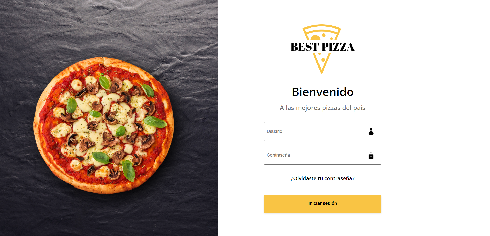

# Best Pizza
:eye: [Preview](https://bestpizza-altguerrero.netlify.app)



This is a [React](https://reactjs.org) project built with [`webpack`](https://webpack.js.org/). **Best pizza** is a web application in which you can start and close the section, when you enter you will be able to list and filter the available stores, then, you will be able to consult more details of each store where you can find information about it and its available products.

## Getting Started

* First, clone this repository.

* second, install the project dependencies.

```bash
npm install
# or
yarn
```

* third, run the development server:

```bash
npm start
# or
yarn start
```

Open [http://localhost:8080/](http://localhost:8080/) with your browser to see the result.

You can start editing the page by modifying `src/pages/Home.jsx`. The page auto-updates as you edit the file.

## Learn More

To learn more about the technologies used in this project, see the following resources:

- [React.js Documentation](https://reactjs.org/docs/getting-started.html)
- [Webpack](https://webpack.js.org/)
- [Babel](https://babeljs.io/)
- [Axios](https://www.npmjs.com/package/axios)
- [Sass](https://sass-lang.com/)

## Deploy on Nextlify

The easiest way to deploy your React.js app is to use the [Nextlify Platform](https://www.netlify.com).

See the [Nextlify deployment documentation](https://docs.netlify.com/) for more details.

